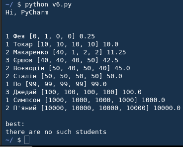
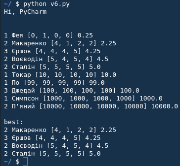

# lab-2
Друга лабораторна робота. Мова програмування python. Весь код писав студент першого курсу: Тимофій Бочкор.

<b>Варіант 2</b>. Описати структуру з іменем STUDENT, яка містить наступні поля:
 1. Прізвище і ініціали.
 2. Номер групи.
 3. Успішність (масив із чотирьох елементів).

Написати програму, яка виконує наступні дії:
 1. Впорядковує записи STUDENTпо зростанню середнього балу.
 2. Виведення на екран прізвищ і номерів груп для всіх студентів, включених в масив, які мають оцінки 4 і 5.
 3. Якщо таких студентів нема, то вивести відповідне повідомлення.

док:
[DOCUMENTATION](DOC)

[library](library.py)
[start file](main.py)

